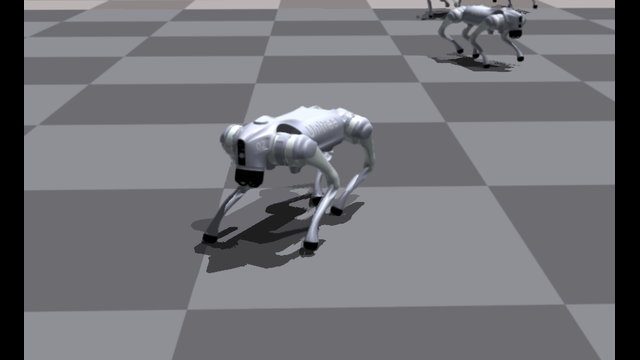
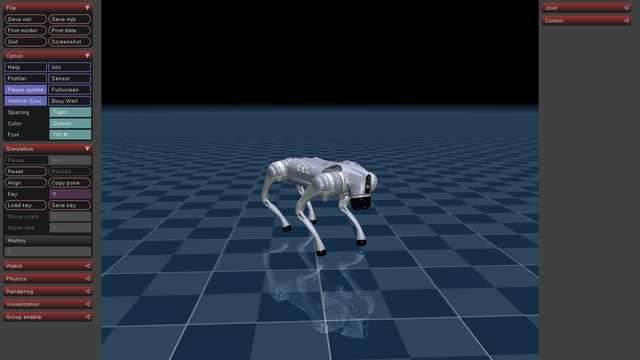

<div align="center">
    <h1 align="center">AMP GO2</h1>
</div>
<div align="center">
AMP implementation for go2 edu
</div>
<div align="center">

| <div align="center"> Isaac Gym </div> | <div align="center"> Mujoco </div> |
|--- | --- |
|   |  
</div>


**reference code:** [Amp for Hardware](https://github.com/escontra/AMP_for_hardware) , [rl_amp](https://github.com/fan-ziqi/rl_amp)

**reference paper:**  [Adversarial Motion Priors Make Good Substitutes for Complex Reward Functions](https://arxiv.org/pdf/2203.15103)

### Installation ###
1. Create a new python virtual env with python 3.8
```bash
conda create -n go2_amp python=3.8
```
2. activate conda env
```bash
conda activate go2_amp
```
3. Install pytorch:
```bash
pip3 install torch torchvision --index-url https://download.pytorch.org/whl/cu126
```
4. Install Isaac Gym
- Download and install Isaac Gym Preview 3 (Preview 2 will not work!) from https://developer.nvidia.com/isaac-gym
```bash
cd isaacgym/python && pip install -e .
```
- Try running an example `cd examples && python 1080_balls_of_solitude.py`
- For troubleshooting check docs `isaacgym/docs/index.html`
4. Install rsl_rl (PPO implementation)
- Clone https://github.com/leggedrobotics/rsl_rl
```bash
cd rsl_rl && git checkout v1.0.2 && pip install -e .
``` 
5. clone this repository
```bash
git clone https://github.com/ak1raljl/amp_go2.git
cd legged_gym && pip install -e .
```
6. dependency
```bash
pip install tensorboard pybullet==3.2.7 lxml==6.0.2 transformations==2022.9.26
```

### Dataset ###

The go2 dataset is recorded from [legged_control
](https://github.com/ak1raljl/legged_control).

- run legged_control
```bash
roslaunch legged_unitree_description empty_world.launch
roslaunch legged_controllers load_controller.launch cheater:=false
```

- record motions from `legged_control`

```bash
# first deactivate the env
conda deactivate 

# forward 1.0 m/s, 5s
python3 datasets/record_legged_control_amp.py   \
--out datasets/go2_motion/go2_forward.txt       \
--rate 50                                       \
--rate 50                                       \
--duration 5                                    \
--cmd-vel 1.0 0.0 0.0                           \
--zero-root-xy

# left 0.6 m/s, 5s
python3 datasets/record_legged_control_amp.py   \
--out datasets/go2_motion/go2_turn_left.txt     \
--rate 50                                       \
--rate 50                                       \
--duration 5                                    \
--cmd-vel 0.0 0.0 0.6                           \
--zero-root-xy
```

- you can check the dataset in gym by running:

```bash
conda activate go2_amp
python datasets/visualize_amp_motion.py --task=go2_amp
```


### Train ###

```bash
python legged_gym/legged_gym/scripts/train.py --task=go2_amp
```

-  To run on CPU add following arguments: `--sim_device=cpu`, `--rl_device=cpu` (sim on CPU and rl on GPU is possible).
-  To run headless (no rendering) add `--headless`.
- **Important**: To improve performance, once the training starts press `v` to stop the rendering. You can then enable it later to check the progress.
- The trained policy is saved in `legged_gym/logs/<experiment_name>/<date_time>_<run_name>/model_<iteration>.pt`. Where `<experiment_name>` and `<run_name>` are defined in the train config.
-  The following command line arguments override the values set in the config files:
    - --task TASK: Task name.
    - --resume:   Resume training from a checkpoint
    - --experiment_name EXPERIMENT_NAME: Name of the experiment to run or load.
    - --run_name RUN_NAME:  Name of the run.
    - --load_run LOAD_RUN:   Name of the run to load when resume=True. If -1: will load the last run.
    - --checkpoint CHECKPOINT:  Saved model checkpoint number. If -1: will load the last checkpoint.
    - --num_envs NUM_ENVS:  Number of environments to create.
    - --seed SEED:  Random seed.
    - --max_iterations MAX_ITERATIONS:  Maximum number of training iterations.


### Play ###
```bash
python legged_gym/legged_gym/scripts/play.py --task=go2_amp
```

- `play.py` will automatically load the latest run and latest checkpoint under `legged_gym/logs/go2_amp/`.
- If you want to load a specific checkpoint, you can specify `load_run` and `checkpoint`:

```bash
python legged_gym/legged_gym/scripts/play.py \
  --task=go2_amp \
  --load_run Apr20_12-00-00_flat \
  --checkpoint 4000
```

- During play, the script disables noise / push / friction randomization and reduces the number of envs, so it is more suitable for visualization than training.
- `play.py` also exports a TorchScript policy to:

```bash
legged_gym/logs/go2_amp/exported/policies/policy_1.pt
```

- This exported policy is used directly by the MuJoCo Sim2Sim script below.

### Sim2Sim ###

This repository provides Isaac Gym policy replay in MuJoCo through `deploy_mujoco/deploy_go2.py`.

1. Install additional dependencies:

```bash
pip install mujoco pygame pyyaml imageio
```

2. Make sure the TorchScript policy exists. The easiest way is to run `play.py` once after training, which will export:

```bash
legged_gym/logs/go2_amp/exported/policies/policy_1.pt
```

3. Run MuJoCo Sim2Sim from the repository root:

```bash
python deploy_mujoco/deploy_go2.py
```

- Keyboard control:
  - `W / S`: forward / backward
  - `A / D`: left / right
  - `Q / E`: yaw left / yaw right

- Save video:

```bash
python deploy_mujoco/deploy_go2.py --save-video
```

- Main config file: `deploy_mujoco/configs/go2.yaml`
  - `policy_path`: exported TorchScript policy path
  - `xml_path`: MuJoCo scene file
  - `simulation_dt` and `control_decimation`: control frequency
  - `cmd_range`: keyboard command limits

- Available MuJoCo scenes can be switched by changing `xml_path`, for example:
  - `deploy_mujoco/go2_description/flat.xml`
  - `deploy_mujoco/go2_description/stairs.xml`
  - `deploy_mujoco/go2_description/cross_slope.xml`
  - `deploy_mujoco/go2_description/race_track.xml`

- `go2.yaml` should stay consistent with the training config, especially `num_obs`, `action_scale`, `kps`, `kds`, `default_angles`, and joint order. If these values do not match the Isaac Gym side, MuJoCo replay will behave incorrectly.

### Sim2Real ###
refer to my sim2real repository [go2_sim2sim_deploy](https://github.com/ak1raljl/go2_sim2sim_deploy)
